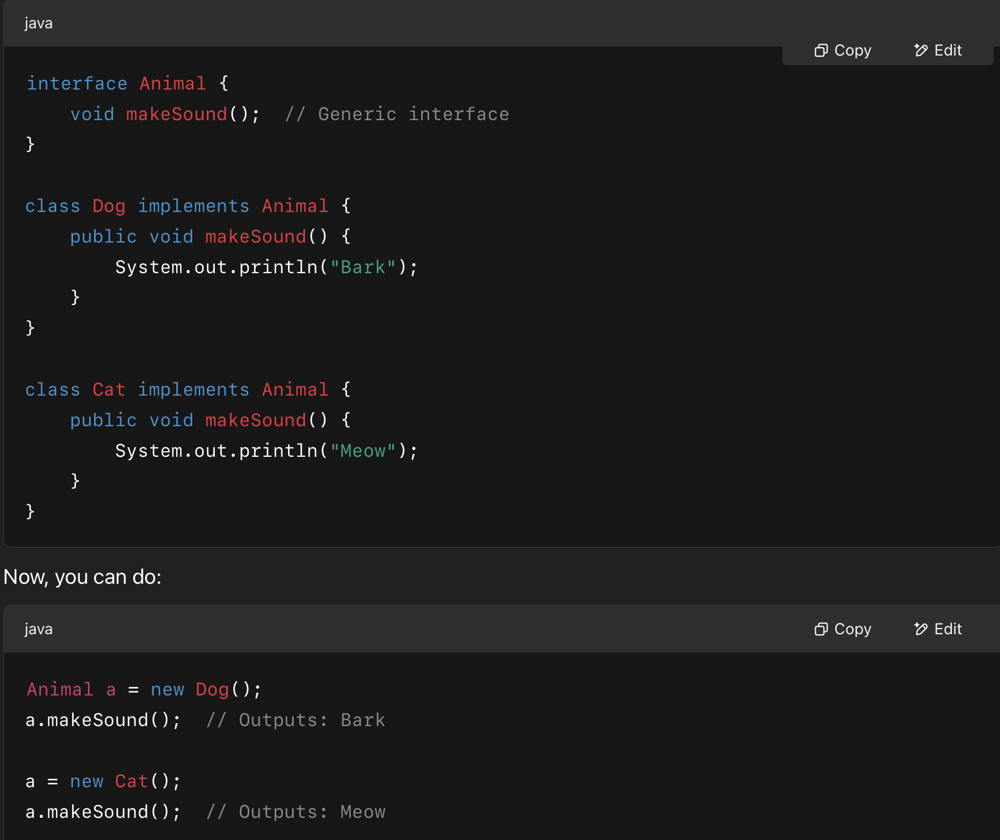

# JAVA more on the technical side
 Object Oriented programming is the main aspect that we are trying to grasp in CCPROG-3 and Java is just that, a Object Oriented programming language

## OOP
  There are two ways in organizing a program,
  - The code (what is happening)
  - The data (what is being affected)
  
  Structured programming focus on the code, what is happening. **C/C++**. 
  *code acting on data*
  
  Object Oriented programming focuses on the data. **JAVA**.
  *data controlling access to code*

  The following will be talking abuot the characteristics of OOP

#### Encapsulation: Bundling + access control
  - Binds together code and the data, it manipulates. 
  - It keeps data safe and misuse (public/private?)
  - Create a box > box contains: data and code > what's inside is isolated
  - Class > blue print: What does this certain box contain? 
  - Object > the instance of that blueprint
  - Private > code or data is only known to the other parts of the same object
  - Public > other parts of the program can access it
  - Members > the things inside the object the specific data or code
    - Specifically, data defined by the class > member variables/instance variables
  - Method > in C/C++ its called a *function*
 --- 
  In short encapsulation puts code (**method**) and data (**members**) into one object, in which it's structure is described in a **class**. **BUNDLING**

  Keywords like *public* and *private* controls access to the members and methods **ACCESS CONTROL**

#### Polymorphism
  - many forms
  Polymorphism means designing a generic interface for similar activities, and then allowing each class to customize the behavior of that interface to fit its specific needs.
 

